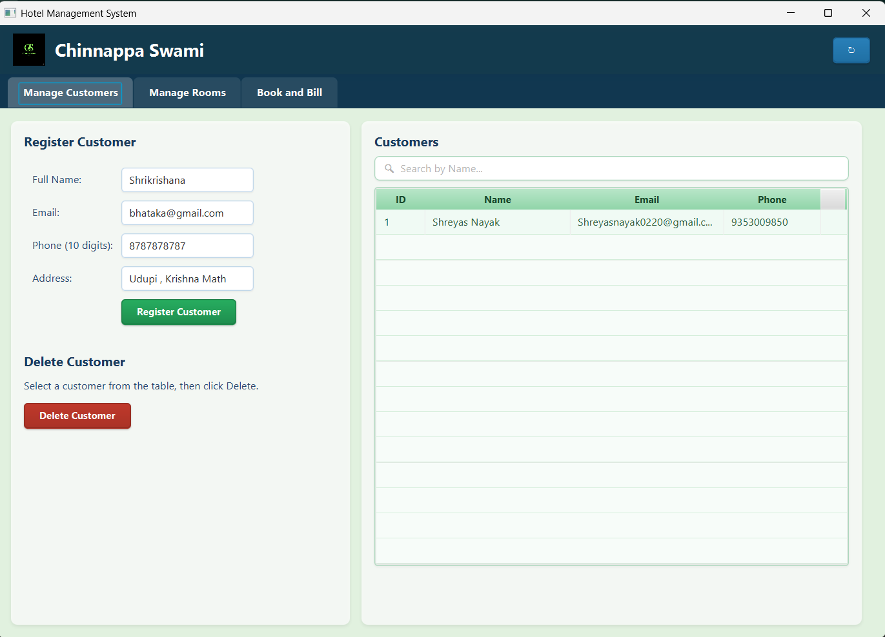
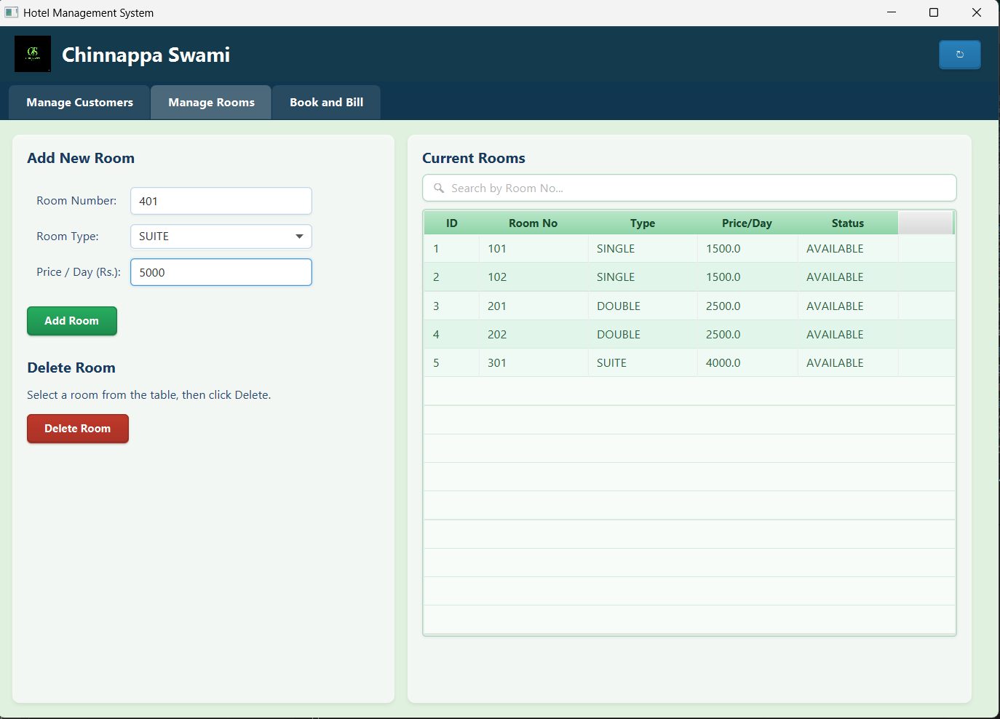
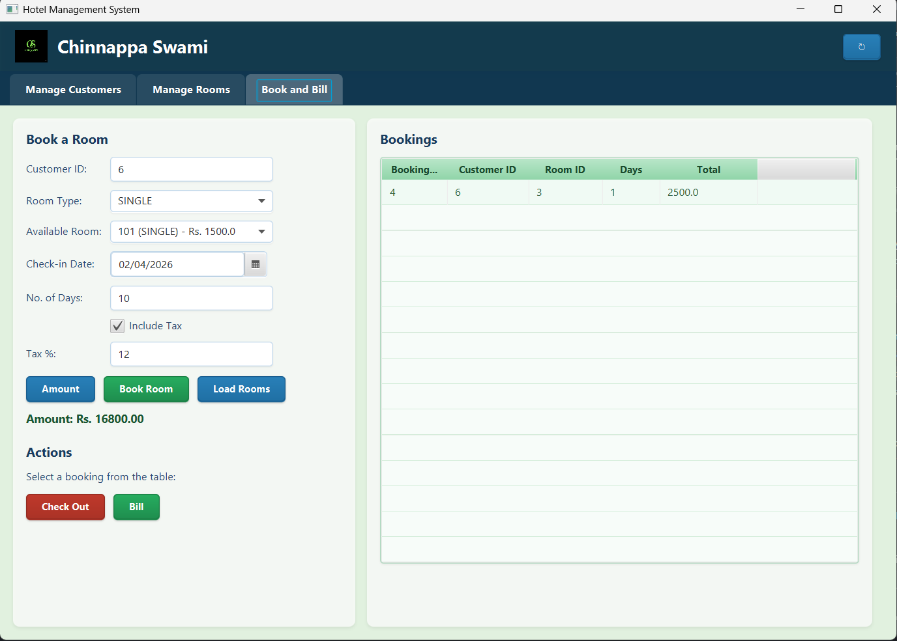
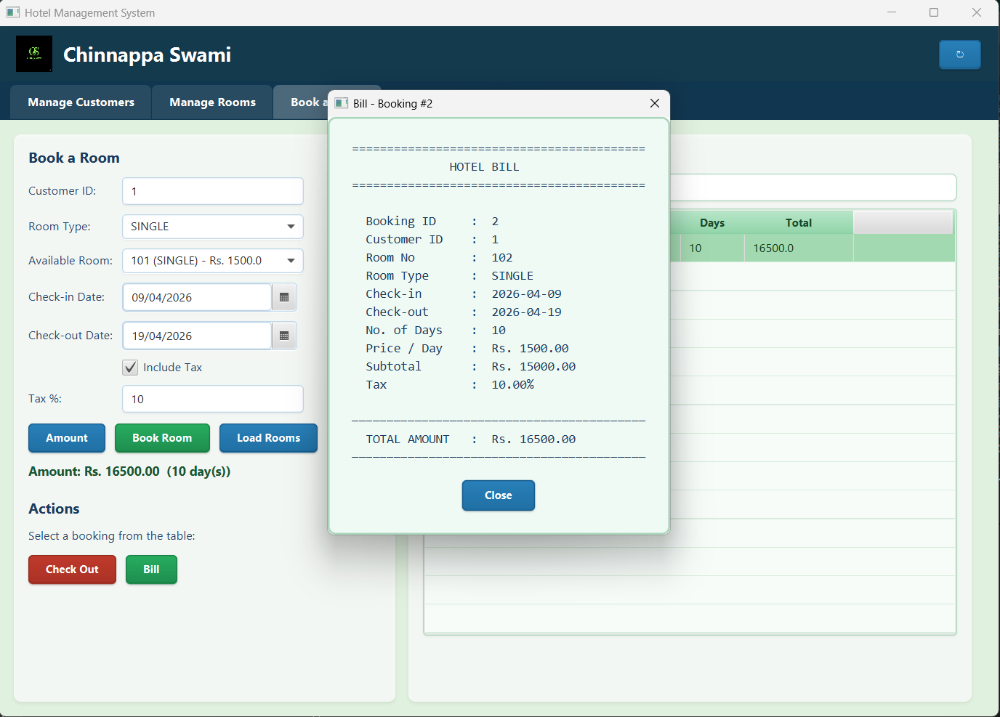
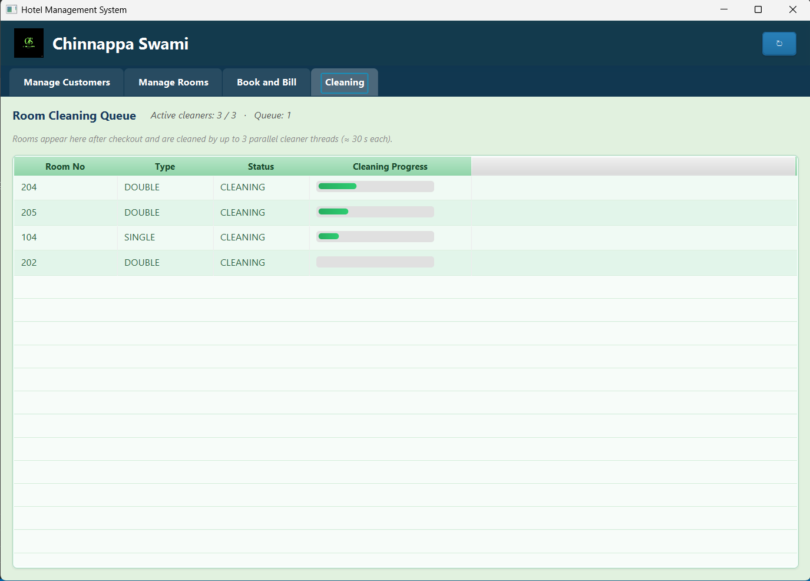

<p align="center">
  
</p>

<h1 align="center">🏨 Hotel Management System</h1>

<p align="center">
  <b>A full-featured desktop hotel management application with room booking, customer management, and billing — built with JavaFX and MySQL.</b>
</p>

<p align="center">
  
  
  
  
  
</p>

---

## 📖 About

**Hotel Management System** is a desktop application designed to streamline hotel operations. It allows staff to register customers, manage rooms, make bookings, generate detailed bills, and handle checkouts — all through a clean and modern JavaFX-based GUI backed by a MySQL database.

---

## ✨ Features

| Feature | Description |
|---|---|
| 👤 **Customer Management** | Register, view, and delete customer records |
| 🛏️ **Room Management** | Add, view, and delete rooms with type and pricing |
| 📅 **Room Booking** | Book available rooms with check-in dates and duration |
| 🧾 **Billing & Tax** | Preview bills with optional tax calculation before confirming |
| 🖨️ **Bill Popup** | View a formatted itemized hotel bill for any booking |
| 🧹 **Room Cleaning** | Track and manage room cleaning tasks and status |
| 🔁 **Checkout** | Release booked rooms back to available status on checkout |
| 🔍 **Live Filtering** | Filter available rooms dynamically by room type |
| 💾 **MySQL Persistence** | All data persisted in a relational MySQL database |
| 🎨 **Styled UI** | Custom CSS-styled JavaFX interface with a professional look |

---

## 🛠️ Tech Stack

<table align="center">
  <tr>
    <td align="center" width="120">
      
      <br /><b>Java 17</b>
    </td>
    <td align="center" width="120">
      
      <br /><b>MySQL 8</b>
    </td>
    <td align="center" width="120">
      
      <br /><b>Maven</b>
    </td>
  </tr>
  <tr>
    <td align="center" width="120">
      <br />🖥️<br /><b>JavaFX 21</b>
    </td>
    <td align="center" width="120">
      <br />🗂️<br /><b>FXML</b>
    </td>
    <td align="center" width="120">
      <br />🎨<br /><b>CSS Styling</b>
    </td>
  </tr>
</table>

---

## 📁 Project Structure

```
hotel-management-system/
│
├── pom.xml                          # Maven build config
├── src/
│   ├── main/
│   │   ├── java/
│   │   │   └── com/hotel/management/
│   │   │       ├── MainApp.java                    # JavaFX entry point
│   │   │       ├── module-info.java                # Java module descriptor
│   │   │       ├── cleaning/
│   │   │       │   ├── CleaningManager.java        # Cleaning task management
│   │   │       │   └── RoomCleaner.java            # Room cleaner entity
│   │   │       ├── controller/
│   │   │       │   └── BookingController.java      # Main UI controller
│   │   │       ├── db/
│   │   │       │   └── DatabaseConnection.java     # MySQL JDBC connection
│   │   │       ├── model/
│   │   │       │   ├── Booking.java                # Booking entity
│   │   │       │   ├── Customer.java               # Customer entity
│   │   │       │   └── Room.java                   # Room entity
│   │   │       └── service/
│   │   │           ├── BillingService.java         # Bill & tax calculation
│   │   │           ├── BookingService.java         # Booking CRUD
│   │   │           ├── CustomerService.java        # Customer CRUD
│   │   │           ├── RoomService.java            # Room CRUD
│   │   │           └── Repository.java             # Data repository
│   │   └── resources/
│   │       ├── schema.sql                          # Database schema & seed data
│   │       └── com/hotel/management/
│   │           ├── main-view.fxml                  # UI layout (FXML)
│   │           ├── styles.css                      # Custom stylesheet
│   │           ├── Logo.jpg                        # App logo
│   │           └── Background_Image.jpg            # UI background
│
└── Required_images/                 # Screenshots & assets
    ├── Logo.jpg
    ├── Background_Image.jpg
    ├── Bill.png
    ├── Book.png
    ├── Cleaning.png
    ├── Manage_customers.png
    └── Managae_rooms.png
```

---

## 🚀 Getting Started

### Prerequisites

- **Java 17+** installed on your system
- **Maven 3.x** installed
- **MySQL 8.x** running locally
- An IDE like **IntelliJ IDEA** or **Eclipse** *(recommended)*

### Database Setup

**1.** Open your MySQL client and run the schema script:

```bash
cmd /c "mysql -u root -p < src/main/resources/schema.sql"
```

This creates the `hotel_management` database with the `rooms`, `customers`, and `bookings` tables, and seeds 5 sample rooms.

**2.** Update your database credentials in `DatabaseConnection.java`:

```java
private static final String URL = "jdbc:mysql://localhost:3306/hotel_management";
private static final String USER = "your_mysql_username";
private static final String PASSWORD = "your_mysql_password";
```

### Installation & Run

**1.** Clone the repository

```bash
git clone https://github.com/ChinnappaSwami/hotel-management-system.git
cd hotel-management-system
```

**2.** Build the project

```bash
mvn clean install
```

**3.** Run the application

```bash
mvn javafx:run
```

---

## ⚙️ Database Schema

```sql
-- Rooms: room_id, room_number, room_type, price_per_day, status
-- Customers: customer_id, full_name, email, phone, address, created_at
-- Bookings: booking_id, customer_id, room_id, check_in_date,
--            check_out_date, number_of_days, tax_percent, total_amount
```

**Default seed rooms:**

| Room No | Type   | Price/Day |
|---------|--------|-----------|
| 101     | SINGLE | Rs. 1500  |
| 102     | SINGLE | Rs. 1500  |
| 201     | DOUBLE | Rs. 2500  |
| 202     | DOUBLE | Rs. 2500  |
| 301     | SUITE  | Rs. 4000  |

---

## 🖥️ How It Works

```
┌─────────────────┐     ┌──────────────────┐     ┌──────────────────┐
│ Register        │────▶│  Select Room     │────▶│  Book & Preview  │
│ Customer        │     │  by Type         │     │  Bill (+ Tax)    │
└─────────────────┘     └──────────────────┘     └────────┬─────────┘
                                                          │
                                                          ▼
                        ┌──────────────────┐     ┌──────────────────┐
                        │  Checkout →      │◀────│  Confirm Booking │
                        │  Room Available  │     │  Save to MySQL   │
                        └──────────────────┘     └──────────────────┘
```

1. **Register** a customer with name, phone, email, and address.
2. **Select a room type** (SINGLE / DOUBLE / SUITE) to see available rooms.
3. **Set check-in date**, number of days, and optionally apply a tax %.
4. **Preview the bill** before confirming to see the total amount.
5. **Confirm booking** — the room status is marked as `BOOKED` in the database.
6. **View the bill** anytime from the Bookings table via the Show Bill button.
7. **Checkout** to free the room and remove the booking record.

---

## 📸 Screenshots

> | Manage Customers | Manage Rooms |
> |---|---|
> |  |  |

> | Booking & Bill | Bill Popup |
> |---|---|
> |  |  |

> | Room Cleaning |
> |---|
> |  |

---

## 📝 Dependencies

| Package | Version | Purpose |
|---|---|---|
| `javafx-controls` | 21.0.2 | UI controls & TableView |
| `javafx-fxml` | 21.0.2 | FXML-based UI layout |
| `mysql-connector-j` | 8.3.0 | MySQL JDBC driver |

---

## 🤝 Contributing

Contributions, issues, and feature requests are welcome!

1. **Fork** the repository
2. **Create** a feature branch (`git checkout -b feature/amazing-feature`)
3. **Commit** your changes (`git commit -m 'Add amazing feature'`)
4. **Push** to the branch (`git push origin feature/amazing-feature`)
5. **Open** a Pull Request

---

## 📄 License

This project is licensed under the **MIT License** — see the [LICENSE](LICENSE) file for details.

---

## 👤 Author

<p align="center">
  <b>ChinnappaSwami</b>
</p>

<p align="center">
  <a href="mailto:shreyasnayak0220@gmail.com">
    
  </a>
</p>

---

<p align="center">
  Made with ❤️ by <b>ChinnappaSwami</b>
</p>

<p align="center">
  ⭐ Star this repository if you found it helpful!
</p>